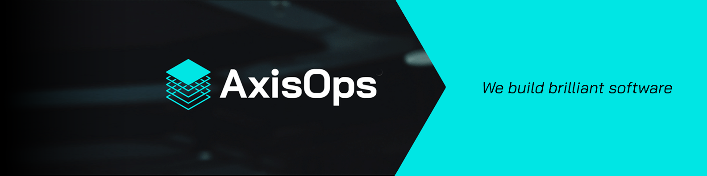

# AxisOps // Systems, Platforms, AI and Engineering Excellence

*Building scalable, secure, and automated platforms for the modern enterprise. Since 2013*

We are a UK-based technology consultancy helping organisations design, build, and operate secure, high-performance systems.

---

## About AxisOps

🔗 [**Website**](https://www.axisops.com)  
🏢 United Kingdom  
🛠️ DevOps · Platform Engineering · AI/ML Engineering · Software Development  

We specialise in:

- Secure, high-quality software delivery (PHP, Python backends, JavaScript, and native mobile front-ends)  
- Infrastructure as Code (Terraform, Ansible)  
- Kubernetes and container orchestration  
- CI/CD pipelines and DevSecOps practices  
- Cloud and on-prem platforms (AWS, Azure, VMware, KVM)  
- Observability and modern monitoring (Prometheus, Grafana, Loki, ELK)
- Applied machine learning and data engineering  
- Continuous improvement and engineering leadership  

Our mission is to help organisations build robust, secure, and maintainable systems that support their innovation and growth.

---

## What You’ll Find Here

✅ Infrastructure automation modules  
✅ CI/CD frameworks  
✅ Cloud-native reference architectures  
✅ AI and ML engineering patterns  
✅ DevSecOps practices and templates  
✅ Internal open-source and community contributions  

These projects are the behind-the-scenes, foundational parts of our platform — practical building blocks that keep systems secure, reliable, and scalable.

---

## Community & Contributions

We welcome your involvement! Feel free to:

- ⭐ Star projects you find useful  
- 🐛 Report issues to help improve them  
- 📢 Contribute via pull requests  
- 💬 Join discussions  

Your feedback and participation make our work better for everyone.

---

## Work With Us

AxisOps works with clients at every stage of their technology journey — from greenfield builds to modernisation programs. Whether you need infrastructure automation, platform engineering, ML pipelines, or high-quality custom software, we can help.

📧 **[hello@axisops.com](mailto:hello@axisops.com)**  
🌐 **[https://www.axisops.com](https://www.axisops.com)**

---

## Security Policy

We take security seriously. If you discover a vulnerability in any of our published code, please report it responsibly to:

📧 **[security@axisops.com](mailto:security@axisops.com)**

---

## License

Unless otherwise specified, projects are licensed under the [MIT License](https://opensource.org/licenses/MIT) or another permissive open-source license. Check each repository for details.

---

> **“Solid code, caffeine-fueled, but running low on snacks.”** 
> — The AxisOps Engineering Team
